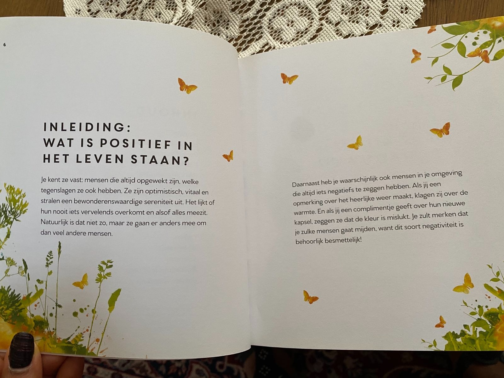

# Deel 1: De Kracht van Positief Denken

2 t/m 10

## Inleiding:

### Wat is positief in het leven staan?

Je kent ze vast, mensen die altijd opgewekt zijn, welke tegenslagen ze ook hebben. Ze zijn optimistisch, vitaal en
stralen een bewonderenswaardige sereniteit uit. Het lijkt of hun nooit iets vervelendfs overkomt en alsof alles meezit.
Natuurlijk is dat niet zo, maar ze gaan er anders mee om dan veel andere mensen.

Daarnaast heb je waarschijnlijk ook mensen in je omgeving die altijd iets negatiefs te zeggen hebben. Als jij een
opmerking over het heerlijke weer maakt klagen zij over de warmte. en als jij een complimentje geeft over hun nieuwe
kapsel, zeggen ze dat de kleur is mislukt. Je zult merken dat je zulke mensen gaat mijden, want dit soort negativiteit
is behoorlijk besmettelijk.

### Houd je gezicht naar de zon gericht en je ziet geen schaduwen

Toch hebben we er allemaal van tijd tot tijd last van en in sommige situaties is het heel lastig om uit die negatieve
gedachten te komen. Want soms is het leven nu eenmaal moeilijk. Je kunt je baan verliezen en vol goede moed aan het
solliciteren gaan, maar constant worden afgewezen. Op zo'n moment valt het niet mee om fris en vrolijk aan je volgende
brief te beginnen. Of je relatie wordt verbroken, je huisdier overlijdt, je verliest een dierbare. Allemaal situaties
die echt niet van de goede kant te zien zijn.

Gelukkig is het toch mogelijk om positief in het leven te staan, zelfs als je bijzonder nare situaties meemaakt. In dit
boek vol positiviteit lees je hoe.

### VERGELIJK JEZELF NIET MET ANDEREN. JE KUNT DE ZON EN DE MAAN NIET VERGELIJKEN, ZE SCHIJNEN ELK OP HUN EIGEN TIJD. HET GEVAAR VAN NEGATIVITEIT

Het is gemakkelijker negatief te denken dan positief. Overal worden we erop gewezen dat we dingen niet goed doen: we
zitten te veel, we moeten afvallen, de wereld staat in brand... Op alle vlakken lijkt het of we niet goed bezig zijn.
Doodgewone zaken zoals nieuws en sociale media kunnen ons leven knap lastig maken.

#### Waarom denken we zo gemakkelijk negatief?

Onze hersenen bevatten meer receptoren voor negatieve zaken dan voor positieve. Dat stamt nog uit de oertijd. Er lag
overal gevaar op de loer, van een roofdier tot een rivaliserende stam; het was flink uitkijken geblazen. Om te overleven
moest je constant alert zijn op gevaar (negatief) en voedsel vinden (positief). Lukte het een dag niet om voedsel te
vinden, dan overleefde je dat wel. Nieuwe dag, nieuwe kansen. Lukte het een dag niet om gevaar te ontwijken, dan was de
kans groot dat er geen nieuwe dag kwam.

Dat verklaart waarom we het negatieve zo goed onthouden. Deze eigenschap was dus nodig om te overleven.
We hebben die eigenschap nu niet meer nodig. Sterker nog: we hebben
er last van. Het is dus hoog tijd om ons op de goede dingen in ons leven te
concentreren!

### Wanneer je negatieve gedachten door positieve vervangt, zie je al snel positieve resultaten.

### Nieuws

Hoewel het misschien moeilijk lijkt om positief te leren denken, valt dat ontzettend mee. Het is vooral een kwestie van
veel oefenen en anders met zaken om leren gaan. Neem nu bijvoorbeeld het nieuws.

Herken je dit? Je staat 's morgens op en leest de nieuws- berichten (alweer veel mensen dakloos door natuurgeweld,
alweer veel oorlogsslachtoffers, alweer rellen over iets waar beter een goed gesprek over zou kunnen worden gevoerd). Je
wordt er moedeloos van. En voor je jezelf kunt tegenhouden, lees je de reacties onder de nieuwsberichten. Mensen die
elkaar al snel voor rotte vis uitmaken en erger. Niet echt een geweldig begin van de dag.
Uit onderzoek is dan ook gebleken dat mensen die het nieuws volgen zich mentaal minder goed voelen dan mensen die het
nieuws niet volgen.

Matt Ridley, voormalig wetenschapsredacteur en correspondent voor The Economist en de auteur van de klassieker De
rationele optimist, heeft een heel andere kijk op het nieuws. Hij zegt bijvoorbeeld dat de extreme armoede op de wereld
de afgelopen twintig jaar nagenoeg is gehalveerd. Omdat dat niet nieuwswaardig is, zullen kranten niet snel koppen met
zulk nieuws.
Een vliegramp op de voorpagina doet het natuurlijk veel beter.

Om je dag niet te laten beïnvloeden door de nieuwsberichten kun je het volgende doen.

# [Lees verder: Deel 2: De Kracht van Positief Denken ]()
