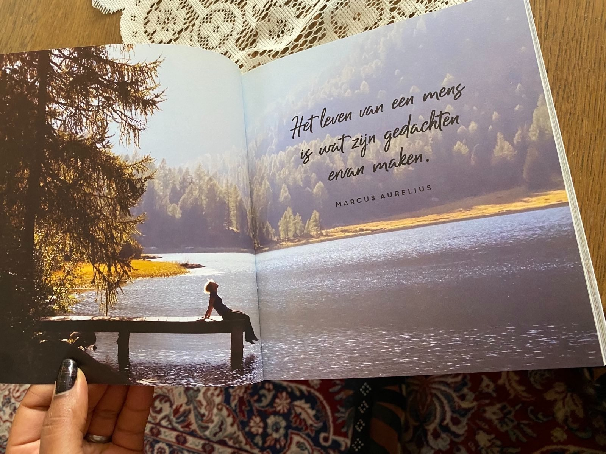

# Deel 2: De Kracht van Positief Denken

11 t/m 20

ZOALS EEN BLOEM DE ZON NODIG HEEFT OM BLOEM TE WORDEN, ZO HEEFT EEN MENS DE LIEFDE NODIG OM MENS TE WORDEN.
— Phil Bosmans

## Fake it till you make it

Deze uitdrukking werd voor het eerst in 1973 gebruikt en is sindsdien in verschillende inspirerende toespraken en
filmpjes te horen. Doe alsof je het kunt, tot je het kunt. Dat geldt niet alleen naar de buitenwereld toe, maar ook naar
jezelf toe.

Psycholoog Amy Cuddy ontdekte tijdens een studie dat het aannemen van een krachtige houding letterlijk zorgt dat je meer
zelfvertrouwen zorgt. Sta rechtop, je benen iets wijd, handen krachtig in je zij. Buig je hoofd niet, maar hef het en
kijk vooruit. Als je dit twee minuten volhoudt, neemt het stresshormoon cortisol af en stijgt je testosteronniveau.
Oefen dit elke dag, wanneer je maar kunt. En maak je niet druk, iets meer testosteron zorgt niet meteen voor een snor,
wel voor meer zelfvertrouwen!

***

***

***

***

***

***

***

***

***

