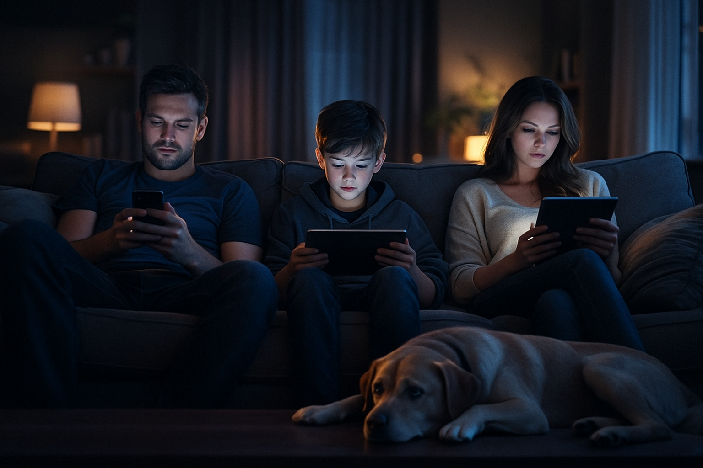

# Schermtijd

Schermen kunnen veel: navigeren, filmen, je vertellen hoe laat het in Tokio is. Maar ze kunnen niet zeggen: ‘Hoe was je
dag?’ en heel eerlijk gezegd: dat merk je.

Schermen zijn tegenwoordig net als kruimels: je vindt ze overal, zelfs op plekken waar je niet eens wist dat je een plek
hád. Telefoons, tablets, tv’s… we gebruiken ze voor werk, ontspanning, het ontkoppelen van de hersenen en soms ook
gewoon omdat we niet weten wat we anders moeten doen. Maar te veel schermtijd heeft zo zijn nadelen, vooral bij
kinderen. Die raken er een beetje prikkelbaar van, alsof hun binnenste voortdurend in de stand “net niet opgeladen”
staat.

Hun concentratie hopt alle kanten op, de creativiteit krimpt tot de grootte van een postzegel, en hun hoofd voelt soms
meer als een op hol geslagen flipperkast dan als een plek waar gedachten rustig kunnen landen. Echte sociale
interactie? Dat wordt ineens ingewikkeld, omdat hun brein vooral getraind is op digitale prikkels die sneller knipperen
dan je met je ogen kunt bijhouden.

Tel alles bij elkaar op en je ziet het al: heel veel schermtijd is niet bepaald de snelweg richting geestelijk welzijn.
Het lijkt eerder op een rotonde waar je maar op blijft rondjes draaien. Emoties die alle kanten opschieten, aandacht die
verdwijnt zoals een wifi-signaal zodra je één stap te ver de tuin in loopt, en gedrag waar ik als ouder soms een
complete gebruiksaanwijzing voor zou willen, en het liefst één met plaatjes.

## Minder schermtijd, meer verbinding

“Het begon met een simpel moment: drie mensen op de bank, allemaal in hun eigen digitale universum. Niemand sprak. Zelfs
de hond keek teleurgesteld.”

En wat blijkt: als je die schermen even parkeert en gewoon een dagje in de la legt, naast het ongebruikte notitieboekje,
dan gaat er iets bijzonders gebeuren. In experimenten (ja, echte onderzoeken, niet “mijn buurvrouw zei het”) knappen
kinderen zichtbaar op. Ze worden socialer, rustiger, en soms zelfs verrassend aangenaam. Alsof ze hersenruimte
terugvinden waarvan je dacht dat het voorgoed in TikTok was opgelost.

>“Eén dag zonder scherm voelt als het losmaken van een onzichtbaar elastiek.” — ouder

***
*En dan nog dit: niet alle schermtijd is hetzelfde. Educatieve video’s zijn iets anders dan urenlang doomscrollen. De
onderzoeken laten vooral verbanden zien — soms stevig, soms subtiel, zoals het verschil tussen regen en motregen. Maar
duidelijk is wel: beetje minder scherm, beetje meer mens. En daar lijkt iedereen gelukkiger van te worden.*

***

## Een schermvrije dag

Dus ja, het scherm. Dat handige, glimmende ding dat altijd ping zegt op precies het verkeerde moment. We kunnen er van
alles mee, behalve er spontaan gelukkiger van worden. En daarom wordt het tijd voor iets radicaals. Iets dat klinkt als
een wellness-retreat maar dan zonder badjassen: één dag per week schermvrij.

Stel je voor: een dag waarop niemand hoeft te doen alsof ze “nog heel even iets moeten checken”. Een dag waarop
gesprekken niet halverwege worden onderbroken door een digitale aardbeving. Een dag waarop gezinsleden elkaar weer
aankijken met echte ogen in plaats van via een selfie-camera.

Klinkt dat als een utopie? Nee hoor. Hooguit als een experiment waar je achteraf trots over kunt opscheppen.

Dus: durf jij het aan? Eén dag zonder scherm. Gewoon proberen. Wie weet ontdek je dat er achter dat zwarte glas nog een
hele wereld zit — eentje die verrassend leuk blijkt te zijn.

> “Er is geen WiFi in net bos, maar je vind er wel een betere verbinding” — 
[onbekend.](https://bitsofpositivity.com/best-screen-free-and-less-screen-time-quotes/)

Hier begint ’t plan:

---

## Het Plan: Eén Dag per Week Schermvrij

### 1. Kies een vaste dag

Bij voorkeur een dag waarop niemand vijftien sportclubs of studiedeadlines heeft. Zondag werkt goed. Zaterdag ook.
Woensdag kan, maar dan moet iedereen mentaal sterk zijn. In elk geval: een dag die altijd hetzelfde blijft, zodat
niemand kan zeggen “Oh… was dat vandaag?”

)

### 2. Maak het officieel

Niet in marmer hakken, maar hang een simpel briefje op de koelkast met: “Vandaag: schermen in winterslaap.” Zo weet
iedereen dat het menens is, zonder dat er iemand een ceremonie hoeft te organiseren.

### 3. Leg de schermen weg (echt weg)

Niet op tafel, niet naast je, niet “voor de zekerheid binnen handbereik”. Gewoon in een lade, kast, schoenendoos, of
een mysterieus plekje waar je normaal af en toe spullen terugvindt waarvan je niet wist dat je ze kwijt was.
> “Als mijn electronica uit staat, blijk ik ineens heel veel te vertellen te hebben.” - kind (15)

### 4. Vervang het scherm door iets anders

Geef het brein een alternatief dat niet flikkert, zoemt of updates vereist. Denk aan spelletjes, wandelen, koken,
kletsen, puzzelen, knutselen, of gewoon samen op de bank hangen en ontdekken dat stilte niet gevaarlijk is.
> “Ik dacht dat ik mijn games zou missen, maar ik miste vooral tijd met mijn ouders.” — kind (14)

### 5. Doe iets als gezin

Plan minimaal één activiteit waar iedereen aan meedoet. Het mag klein zijn: pannenkoeken bakken, een kaartspel, een
familieworkout. Het doel is niet perfectie, maar interactie. Het gaat om die rare grap van je kind die je anders had
gemist omdat je “nog even iets moest lezen”.

### 6. Evalueer samen

Aan het eind van de dag: korte nagesprek-vergadering-light. Wat was fijn? Wat was irritant? Wat voelde onverwacht
rustig? Wat kan volgende week anders? Je hoeft geen notulen te maken. Tenzij iemand dat heel graag wil, dan is die
persoon waarschijnlijk al genoeg gemotiveerd.
>“We hadden geen wifi, dus gingen we maar praten. Blijkbaar kunnen we dat nog.” — ouder

### 7. Herhaal elke week

Na drie à vier weken wordt het een ritueel. Een soort wekelijkse onderhoudsbeurt voor het hoofd. En je merkt dat de
echte gesprekken makkelijker worden. Dat de sfeer anders is. Dat er minder ge-ping is en meer ge-pingpong.
> “Een schermvrije dag levert meer gesprekken op dan welke app dan ook.” — ouder
___

## Waarom één dag per week schermvrij?

> Een vaste schermvrije dag per week geeft rust in het hoofd. Het zorgt dat kinderen (en ouders!) even resetten. Geen
> constante meldingen, geen drukte, geen afleiding. Gewoon tijd. Voor jezelf, voor elkaar, voor echte gesprekken.

## De voordelen voor de geest

- Meer focus: zonder scherm prikkelt de omgeving de fantasie en creativiteit.
- Betere stemming: offline tijd verlaagt stress en geeft ruimte om te ontladen.
- Sterkere sociale vaardigheden: kinderen leren weer écht luisteren, praten en samenwerken.
- Meer verbondenheid: gezinnen die samen tijd doorbrengen, bouwen sterkere relaties op.
- Langetermijnvoordelen: betere zelfregulatie, gezonder slaapritme, hogere mentale weerbaarheid.

Een schermvrije dag voelt misschien even ongemakkelijk, maar levert zoveel op. Je merkt al snel dat er meer echte
interactie ontstaat, zoals gesprekken die ergens over gaan, samen lachen, samen iets doen. Het versterkt de band binnen
het
gezin op een manier die geen app kan vervangen.

***

## Leuke activiteiten voor thuis

- Samen koken of bakken
- Een gezelschapsspel of kaartspel
- Bordspellen of strategiespellen waar je echt je hersens voor moet gebruiken (Catan, Risk, 30 Seconds, etc.).
- Een puzzel leggen
- Een mini-workout of yoga met het hele gezin
- Creatief knutselen of schilderen
- Boeken lezen of elkaar voorlezen
- Boeken of verhalen uitwisselen en elkaar vertellen wat er interessant aan is.
- Muziek maken of samen zingen

***

## Bronnen

> Enkele betrouwbare studies

In een studie getiteld “Effects of Excessive Screen Time on Child Development” wordt weergegeven dat bij jonge kinderen
schermgebruik onafhankelijk geassocieerd is met een verminderd psychisch welzijn (emotionele reactiviteit, agressie,
gedragsproblemen).
[Effects of Excessive Screen Time on Child Development](https://pmc.ncbi.nlm.nih.gov/articles/PMC10353947/)

Een gerandomiseerde klinische studie (de SCREENS‑trial) liet zien dat het verminderen van schermtijd gedurende twee
weken leidde tot significante verbeteringen op het gebied van psychische symptomen en sociaal gedrag bij kinderen en
adolescenten.
[SCREENS‑trial](https://jamanetwork.com/journals/jamanetworkopen/fullarticle/2821176)

Een review wijst erop dat kinderen met veel schermtijd vaker slechtere mentale gezondheid en minder verbinding met de
natuur / fysieke omgeving hebben.
[Screen time and green time](https://www.childrenandnature.org/resources/research-digest-screen-time-and-green-time/)

***
